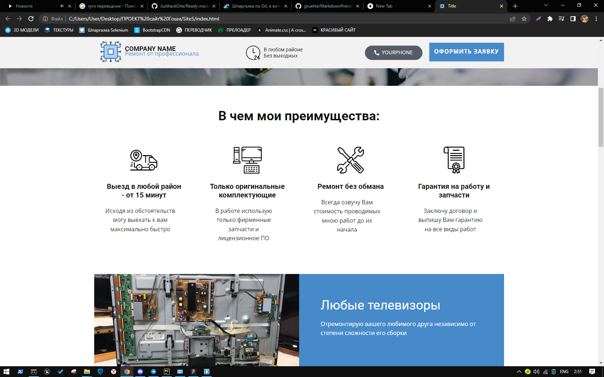
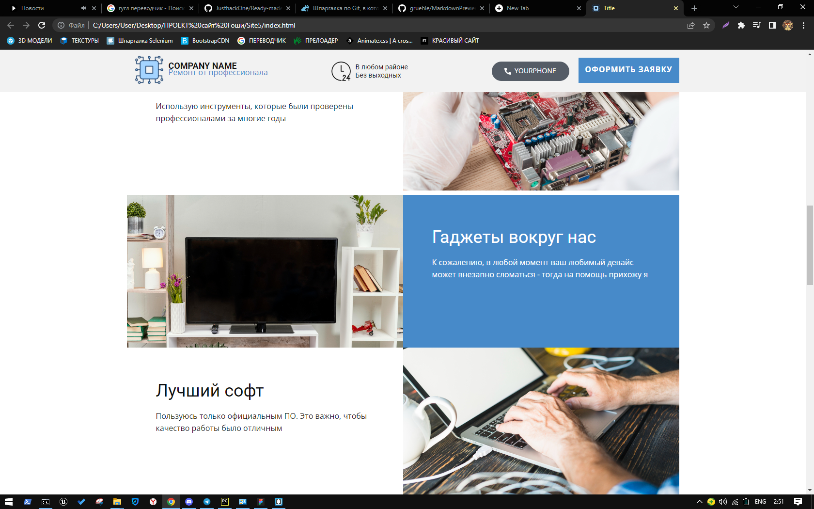
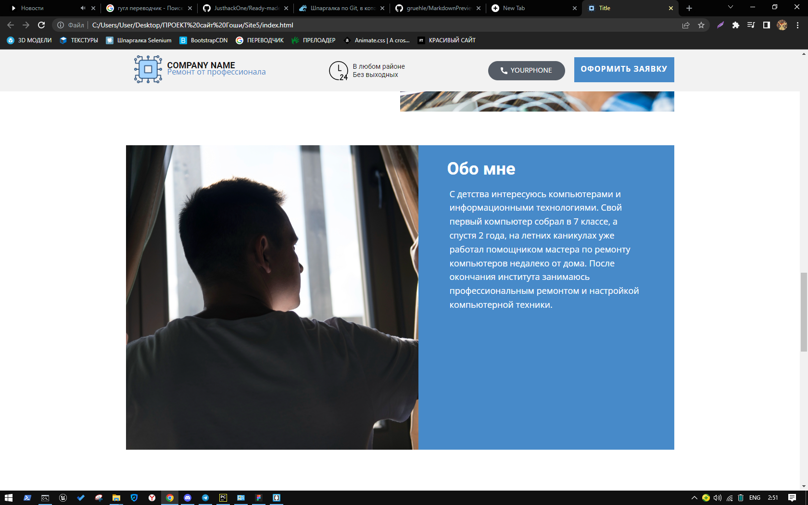
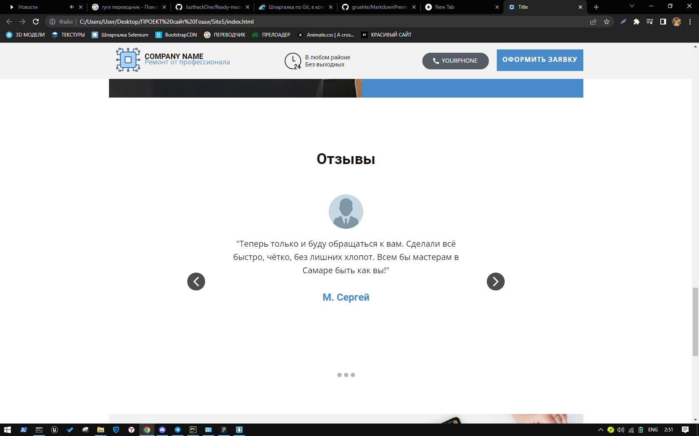
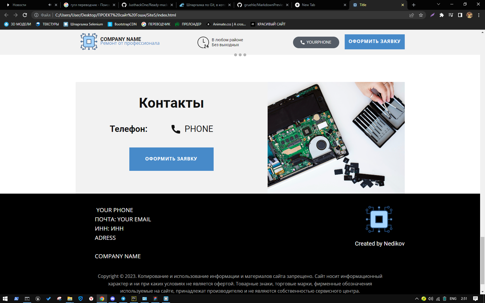

<!DOCTYPE html>
<html style="font-size: 16px;" lang="ru"><head>
    <meta name="viewport" content="width=device-width, initial-scale=1.0">
    <meta charset="utf-8">
    <meta name="keywords" content="How it looks, How can you use it">
    <meta name="description" content="">
    <title>Главная</title>
    <link rel="stylesheet" href="nicepage.css" media="screen">
<link rel="stylesheet" href="Главная.css" media="screen">
    
    
    <meta name="generator" content="Nicepage 5.6.13, nicepage.com">
    <link id="u-theme-google-font" rel="stylesheet" href="https://fonts.googleapis.com/css?family=Roboto:100,100i,300,300i,400,400i,500,500i,700,700i,900,900i|Open+Sans:300,300i,400,400i,500,500i,600,600i,700,700i,800,800i">
    
    
    <meta name="theme-color" content="#478ac9">
    <meta property="og:title" content="Главная">
    <meta property="og:type" content="website">
  <meta data-intl-tel-input-cdn-path="intlTelInput/"></head>
  <body data-home-page="Главная.html" data-home-page-title="Главная" class="u-body u-xl-mode" data-lang="ru"><header class="u-clearfix u-header u-header" id="sec-6e94">

        
        <nav class="u-menu u-menu-dropdown u-offcanvas u-menu-1">
          

            <a class="u-button-style u-custom-left-right-menu-spacing u-custom-padding-bottom u-custom-top-bottom-menu-spacing u-nav-link u-text-active-palette-1-base u-text-hover-palette-2-base" href="#">
              <svg class="u-svg-link" viewBox="0 0 24 24"><use xmlns:xlink="http://www.w3.org/1999/xlink" xlink:href="#menu-hamburger"></use></svg>
              <svg class="u-svg-content" version="1.1" id="menu-hamburger" viewBox="0 0 16 16" x="0px" y="0px" xmlns:xlink="http://www.w3.org/1999/xlink" xmlns="http://www.w3.org/2000/svg"><g><rect y="1" width="16" height="2"></rect><rect y="7" width="16" height="2"></rect><rect y="13" width="16" height="2"></rect>
</g></svg>
            </a>
          

          

            <ul class="u-nav u-unstyled u-nav-1"><li class="u-nav-item"><a class="u-button-style u-nav-link u-text-active-palette-1-base u-text-hover-palette-2-base" href="О-нас.html" style="padding: 10px 20px;">О нас</a>
</li><li class="u-nav-item"><a class="u-button-style u-nav-link u-text-active-palette-1-base u-text-hover-palette-2-base" href="Контакты.html" style="padding: 10px 20px;">Контакты</a>
</li></ul>
          

          

            

              

                

                <ul class="u-align-center u-nav u-popupmenu-items u-unstyled u-nav-2"><li class="u-nav-item"><a class="u-button-style u-nav-link" href="О-нас.html">О нас</a>
</li><li class="u-nav-item"><a class="u-button-style u-nav-link" href="Контакты.html">Контакты</a>
</li></ul>
              

            

            

          

        </nav>
      
</header>
    <section class="u-clearfix u-section-1" id="sec-17fc">
      

        <h1 class="u-text u-text-default u-text-1">How it looks</h1>
        
        
        
        
        
        
        <h1 class="u-text u-text-default u-text-2">How can you use it</h1>
        
 1. Edit the site to suit your needs.  2. In the file along the path /telegramform/php/send-message-to-telegram.php  
          Replace TOKEN (your telegram bot token) and CHAT_ID (your group id, starts with "-") 
           3. To make calling a phone number work, replace the "a" tag with the href="tel:YOUR_PHONE" attribute.
        

        
 1. Отредактируйте сайт под свои нужды.  2. В файле по пути /telegramform/php/send-message-to-telegram.php  
          Замените TOKEN (токен вашего телеграмм бота) и CHAT_ID (id вашей группы, начинается со знака "-")
           3.  Чтобы звонок по номеру телефона работал, замените у тега "a" атрибут href="tel:YOUR_PHONE".
        

      

    </section>
    
     <footer class="u-align-center u-clearfix u-footer u-grey-80 u-footer" id="sec-ec6b">

        
Пример текста. Кликните, чтобы выбрать элемент "Текст".

      
</footer>
    <section class="u-backlink u-clearfix u-grey-80">
      <a class="u-link" href="https://nicepage.com/website-templates" target="_blank">
        Website Templates
      </a>
      

        created with
      

      <a class="u-link" href="" target="_blank">
        Website Builder Software
      </a>. 
    </section>
  
</body></html>
