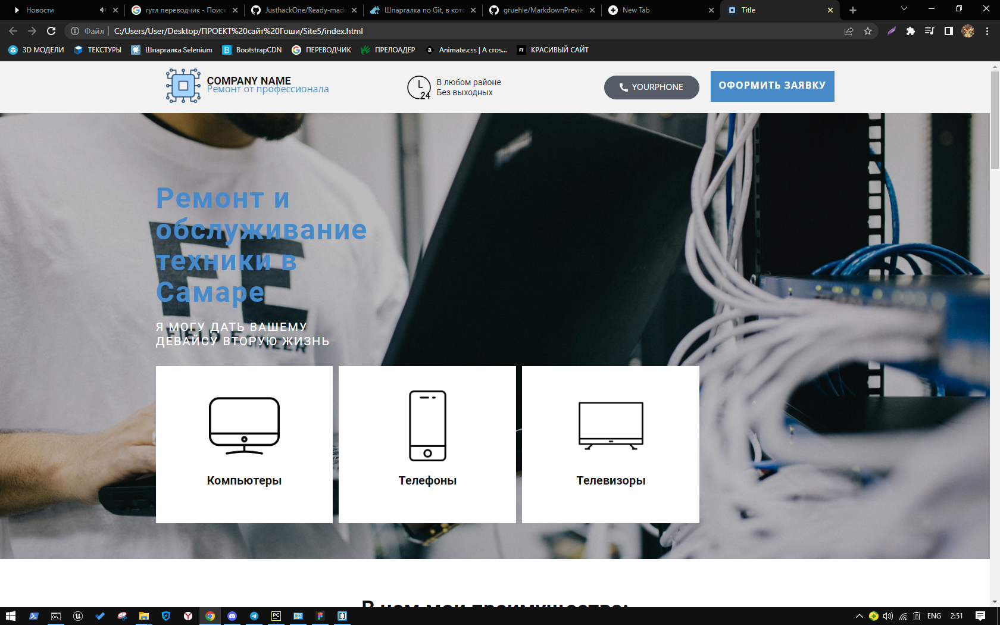

<!DOCTYPE html>
<html style="font-size: 16px;" lang="ru"><head>
   
  <body data-home-page="Главная.html" data-home-page-title="Главная" class="u-body u-xl-mode" data-lang="ru">
    <section class="u-clearfix u-section-1" id="sec-17fc">
      

        <h1 class="u-text u-text-default u-text-1">How it looks</h1>
        
        
        
        
        
        
        <h1 class="u-text u-text-default u-text-2">How can you use it</h1>
        
 1. Edit the site to suit your needs.  2. In the file along the path /telegramform/php/send-message-to-telegram.php  
          Replace TOKEN (your telegram bot token) and CHAT_ID (your group id, starts with "-") 
           3. To make calling a phone number work, replace the "a" tag with the href="tel:YOUR_PHONE" attribute.
        

        
 1. Отредактируйте сайт под свои нужды.  2. В файле по пути /telegramform/php/send-message-to-telegram.php  
          Замените TOKEN (токен вашего телеграмм бота) и CHAT_ID (id вашей группы, начинается со знака "-")
           3.  Чтобы звонок по номеру телефона работал, замените у тега "a" атрибут href="tel:YOUR_PHONE".
        

      

    </section>
    
   
  
</body></html>
